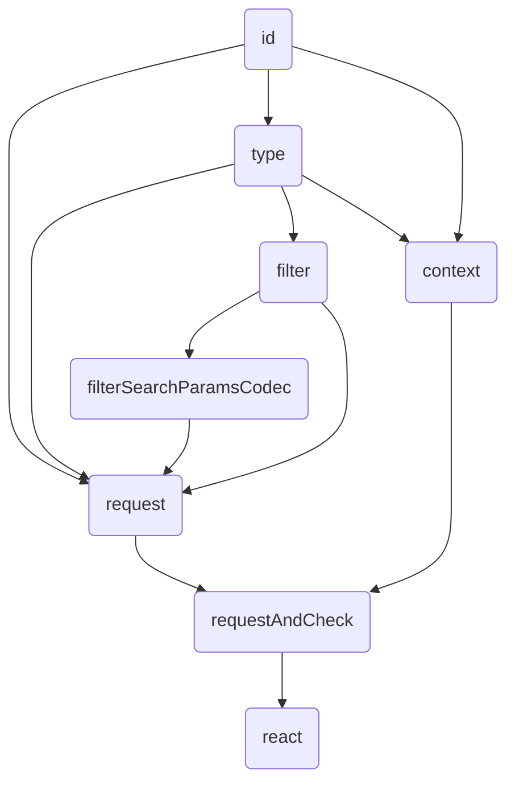

# common

クライアントとサーバー共通で使えるコード

## id

リソースのIDの型

## type

リソースの型定義

## filter

リソース一覧を呼び出すためのフィルターパラメータの型

## filterSearchParamsCodec

フィルターパラメータの型とURLクエリとの変換関数

# server

サーバーのコード

# client

クライアントのコード

## request

APIを呼び出すための関数
