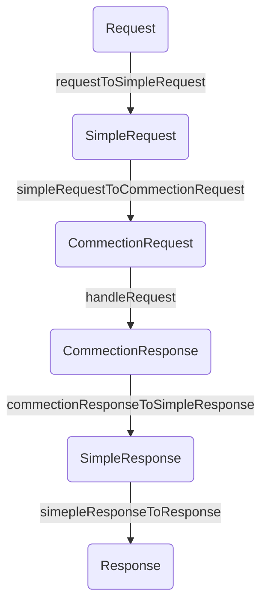

# commection

[](https://gitpod.io/#https://github.com/narumincho/commection)

## Deno Example

```sh
deno run --allow-net=:8000 ./deno/example/main.ts
```

## Editor build command

```sh
deno run -A ./deno/editor/build.ts
```

## Handle request


