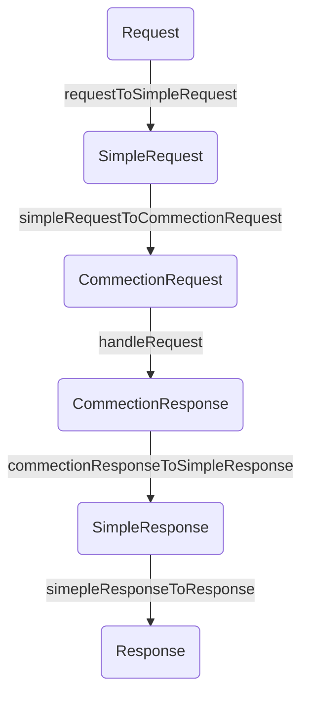

# commection

[](https://gitpod.io/#https://github.com/narumincho/commection)

## Editor build command

```sh
deno run -A ./deno/editor/build.ts
```

## Handle request


```mermaid
graph TB
Request(Request)
SimpleRequest(SimpleRequest)
CommectionRequest(CommectionRequest)
CommectionResponse(CommectionResponse)
SimpleResponse(SimpleResponse)
Response(Response)

Request -->|requestToSimpleRequest| SimpleRequest -->|simpleRequestToCommectionRequest| CommectionRequest -->|handleRequest| CommectionResponse -->|commectionResponseToSimpleResponse| SimpleResponse --> |simepleResponseToResponse|Response
```
